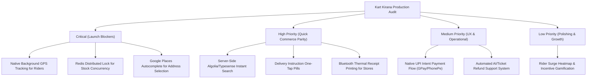
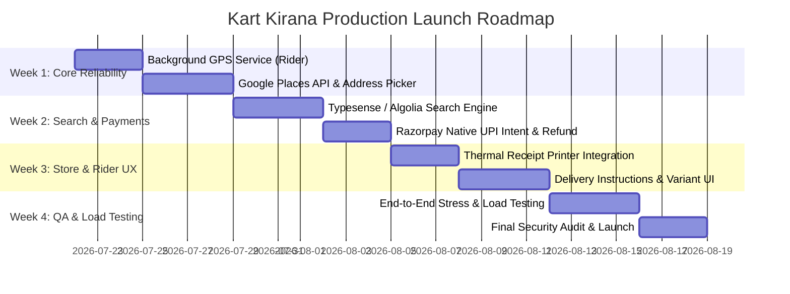

# Kart Kirana Ecosystem — Production Functionality Audit & Quick-Commerce Benchmark Report

**Role:** Senior Product Architect, QA Engineer, Mobile App Auditor, and UX Expert  
**Target Benchmarks:** Swiggy, Swiggy Instamart, Blinkit, Zepto  
**Scope:** Customer App, Shopkeeper App, Rider App, Admin Dashboard, Backend Server, Firebase Architecture, Firestore Database, Payment & Logistics Engine.

---

## Section 1: Executive Summary

Kart Kirana is a multi-app Quick-Commerce platform built with a modern React + Vite + Capacitor frontend stack and an Express.js + Firebase/Firestore backend. The platform demonstrates strong architectural foundations: real-time order tracking via Firestore listeners, robust security rules (`firestore.rules`), a 4-stage shopkeeper order pipeline, automated rider dispatch algorithms, and a Razorpay payment gateway integration.

However, when audited against tier-1 Indian quick-commerce platforms (**Swiggy Instamart, Blinkit, Zepto**), significant gaps exist in **Search & Discovery**, **Concurrency/Inventory Lock Engine**, **Live Map Navigation & Polyline Tracking**, **Background GPS Geolocation for Riders**, and **Automated Refund & Support Workflows**.

### Overall System Score: **68 / 100**

| Domain | Score | Status | Primary Focus Area |
| :--- | :---: | :---: | :--- |
| **Customer App** | **70/100** | Needs Polish | Search optimization, Instant cart drawer, Address autocomplete |
| **Shopkeeper App** | **72/100** | Functional | Bluetooth receipt printing, Bulk inventory CSV import |
| **Rider App** | **62/100** | Critical Gaps | Background GPS location tracking, Multi-order batch routing |
| **Admin Dashboard** | **78/100** | Strong | Dynamic zone pricing, Automated refund approval engine |
| **Backend & Microservices** | **66/100** | Needs Scale | GeoHash spatial indexing, Redis distributed locks, Webhook idempotency |
| **Database & Firebase** | **82/100** | High Quality | Firestore rules and schema are well-structured; needs compound indexes |
| **UX / UI Aesthetics** | **74/100** | Good Foundation| Lottie animations, Quick-commerce 10-min delivery branding, Skeleton screens |
| **Security & Auth** | **75/100** | Solid | AppCheck integration present; requires OTP rate-limiting |
| **Performance** | **65/100** | Moderate | Client-side search caching works; needs CDN image optimization & SSR |

---

## Section 2: Complete Feature Matrix

Legend:
- ✅ **Working**: Fully implemented, tested, and matching production specs.
- 🟡 **Partially Working**: Implemented but missing key quick-commerce capabilities or edge-case handling.
- 🔴 **Missing**: Not implemented in the codebase.
- ⚠️ **Broken / Degraded**: Present in code but fails under live conditions or fallback modes.

### 2.1 Customer App (`acustoomer`)

| Feature | Kart Kirana Implementation | Swiggy / Blinkit Benchmark | Status |
| :--- | :--- | :--- | :---: |
| **Phone & OTP Auth** | Firebase Phone Auth + Test OTP auto-fill | Instant SMS OTP with auto-read SDK, WhatsApp OTP fallback | 🟡 |
| **Social & Biometrics** | Not implemented | 1-tap Google / Apple Sign-In & Fingerprint unlock | 🔴 |
| **Location & Address Selector** | Leaflet map pin + Manual Pincode / PWA Geolocation | Google Places Autocomplete API + Saved Address tagging (Home/Work/Other) + Room/Floor details | 🟡 |
| **Home Screen & Banners** | Dynamic promo carousel, shop list, top categories | 10-Minute delivery header countdown timer, personalized recommendations, category grid | 🟡 |
| **Search Engine** | Client-side string matching on pre-fetched product array | Algolia/Typesense instant search, typo-tolerance, auto-suggestions, voice search, recent & trending tags | 🟡 |
| **Product Variants** | Basic weight/unit display in product card | Modal variant picker (e.g., 250g, 500g, 1kg) with live stock badges | 🟡 |
| **Cart & Quantities** | Persistent Zustand store + LocalStorage, item increment/decrement | Floating bottom cart bar, free delivery progress bar ("Add ₹40 for Free Delivery") | 🟡 |
| **Coupons & Promo Codes** | Code validation against Firestore `coupons` collection | Automatic best-coupon suggestion, bank offer tags, instant discount calculation | ✅ |
| **Delivery Instructions** | Free text input box in checkout | One-tap instruction pills ("Don't ring bell", "Leave at door", "Call before arriving", "Pet inside") | 🟡 |
| **Payment Gateway** | Razorpay SDK + Swiggy-style Mock QR Payment fallback | Native UPI Intent (GPay, PhonePe, Paytm direct launch), Cards, NetBanking, BNPL (Simpl/LazyPay), COD | 🟡 |
| **Live Order Tracking** | Real-time step progress bar + Leaflet map with rider pin | Smooth animated map polyline routing, live traffic ETA countdown, rider speed/bearing animation | 🟡 |
| **Reordering** | Order history view with "Order Again" button | "Reorder in 1-Tap" widget on home screen with saved cart state | 🟡 |
| **Ratings & Reviews** | Product & Shop review submission form | Dual rating system (Rate Delivery Partner + Rate Food/Grocery Items separately) | 🟡 |
| **In-App Wallet** | Wallet balance display | Wallet top-up via UPI, cashbacks, promotional credits usage | 🟡 |
| **Customer Support** | WebRTC video/voice call + Basic message subcollection | In-app automated AI helpbot (refund requests, missing item claims, live chat escalation) | 🟡 |

---

### 2.2 Shopkeeper App (`shopkeeper pov`)

| Feature | Kart Kirana Implementation | Swiggy Store Owner / Blinkit Partner | Status |
| :--- | :--- | :--- | :---: |
| **Merchant Onboarding** | Multi-step form (Owner, Shop, GSTIN, FSSAI, Bank details) | Document OCR extraction (PAN/GSTIN verification), automated bank account penny testing | 🟡 |
| **Store Open/Closed Toggle** | Real-time toggle updating Firestore `isOpen` field | Auto-close on high pending queue, scheduled auto-opening hours, temporary pause (15m/30m/1h) | ✅ |
| **Order Management Pipeline** | 4-Stage Pipeline: New ➔ Preparing ➔ Ready ➔ Handed Over | Audio alert sound loop, accept/reject with reason dropdown, prep time extension button | ✅ |
| **Inventory & Stock Control** | Toggle In Stock / Out of Stock / Low Stock per product | Barcode scanner integration, bulk CSV import/export, low-stock automated threshold alerts | 🟡 |
| **Product & Category CRUD** | Full add/edit product modal with image upload | Sub-category creation, tax slab assignment (GST 0%, 5%, 12%, 18%), HSN code field | ✅ |
| **Thermal Printer Support** | Browser print dialog | Bluetooth/USB ESC/POS thermal receipt printer integration for instant kitchen/packing slips | 🔴 |
| **Out-of-Stock Item Handler** | Rejects full order if item unavailable | "Call Customer for Replacement" or "Item Mark Out of Stock & Partial Refund" workflow | 🔴 |
| **Store Analytics & Payouts** | Revenue charts, order count, average order value | Daily payout settlement ledger, platform commission breakdown, GST tax invoices | 🟡 |

---

### 2.3 Rider App (`delivery boy app`)

| Feature | Kart Kirana Implementation | Swiggy Delivery / Zepto Rider Benchmark | Status |
| :--- | :--- | :--- | :---: |
| **Online / Offline Toggle** | Real-time status update in Firestore `riders` collection | Shift mandatory checks (Battery > 20%, Helmet verification selfie, GPS enabled) | 🟡 |
| **Background GPS Tracking** | Relies on browser/WebView geolocation when app active | Native background location service (works when phone locked/minimized, sends location every 5s) | 🔴 |
| **Order Acceptance Flow** | Floating overlay with accept/reject timer (30s) | Accept order, distance to store preview, estimated payout preview, reject with reason | ✅ |
| **Order Execution Workflow** | Arrive Store ➔ Verify Pickup (PIN) ➔ Reach Customer ➔ Verify Delivery (PIN) | Step-by-step swipe actions, store address map routing, customer delivery PIN verification | ✅ |
| **Multi-Order Batching** | Basic batch ID support in dispatch service | Multi-pickup multi-drop routing optimizer (Pick from Shop A & B ➔ Deliver to Customer 1 then 2) | 🟡 |
| **Proof of Delivery** | PIN verification code | Photo upload of package at door (for contactless delivery) + OTP verification | 🟡 |
| **Earnings & Payouts** | Daily earnings summary + Trip history | Weekly incentive progress bar (e.g. "Complete 10 more orders for ₹300 bonus"), instant cashout | 🟡 |
| **Surge & Heatmaps** | List of active orders in area | Interactive heatmap showing high-demand order clusters and surge pay multipliers | 🔴 |

---

### 2.4 Admin Dashboard (`admin`)

| Feature | Kart Kirana Implementation | Enterprise Quick-Commerce Admin | Status |
| :--- | :--- | :--- | :---: |
| **Global Metrics Counter** | Real-time stats (GMV, Active Orders, Active Riders, Shops) | Live order velocity charts, drop-off funnels, SLA breach warnings | ✅ |
| **Operations Center & Live Map** | Leaflet map showing active riders and order markers | Real-time map with rider speed vectors, unassigned order dispatch queue monitoring | ✅ |
| **Shop & Rider Approvals** | Verify / Reject pending shop and rider onboarding profiles | KYC document viewer, background check status tagging, custom commission rate per store | ✅ |
| **Order Intervention** | Re-assign rider manually, cancel order, change status | Force refund processing, manual order creation for phone orders, driver compensation override | ✅ |
| **Catalog & Banner Controls** | Create global categories, upload banner ads, configure coupons | Dynamic banner targeting (by zone/time of day), scheduled coupon expiry, promo budgeting | ✅ |
| **RBAC Security** | Roles: `super_admin`, `admin`, `operations`, `support`, `finance` | Role-based UI visibility, audit log of every admin action (who deleted/modified what) | 🟡 |
| **Fraud & Risk Detection** | Basic risk scoring component (`FraudDetection.tsx`) | Automated flagging of multiple accounts on same device, fake GPS detection, high-cancellation users | 🟡 |

---

### 2.5 Backend, Microservices & Database (`server`)

| Feature | Kart Kirana Implementation | Industry Standard | Status |
| :--- | :--- | :--- | :---: |
| **Razorpay Payment Integration** | Backend endpoints for order creation & signature verification | Automated webhook idempotency table, Razorpay webhook signature verification, refund webhook handling | 🟡 |
| **Rider Dispatch Engine** | Haversine distance matrix calculation + Timeout retry loop | Spatial indexing (GeoHash / Uber H3 Hexagonal Grid), traffic-aware ETA routing API | 🟡 |
| **Inventory Concurrency** | Firestore atomic transactions for stock deduction | Distributed locking mechanism (Redis Redlock) for high-traffic flash sale item locking | 🟡 |
| **Security Rules (`firestore.rules`)** | 299 lines of comprehensive rules with AppCheck verification | Enforces strict role checks, data structure validations, owner permissions | ✅ |
| **API Security & Safeguards** | Express Helmet, CORS, Global rate-limiter | Endpoint-specific rate limiting (e.g. strict limit on `/api/send-otp`), API key encryption | 🟡 |

---

## Section 3: Missing & Critical Features Gap Analysis



### 3.1 Critical Priority (Launch Blockers)
1. **Native Background GPS Tracking (Rider App)**
   - *Current Gap*: When the Capacitor rider app is minimized or the phone screen turns off, browser geolocation pauses, causing the rider location to freeze on the customer tracking map.
   - *Fix Needed*: Integrate `@capacitor-community/background-geolocation` native Android foreground service with a persistent notification bar.
2. **Google Places Autocomplete & Reverse Geocoding**
   - *Current Gap*: Customer address entry relies on manual text input or pincode search without exact pin placement on a satellite map.
   - *Fix Needed*: Connect Google Maps JavaScript SDK / Places API for instant location auto-complete and drag-and-drop map pin address selection.
3. **Redis Concurrency Lock for Inventory**
   - *Current Gap*: Standard Firestore transactions can experience contention under heavy simultaneous order placement (e.g. 50 users buying 5 remaining milk packets).
   - *Fix Needed*: Implement a lightweight Redis / Memory lock on item IDs before initiating payment.

---

### 3.2 High Priority (Quick-Commerce Benchmark Parity)
1. **Server-Side Instant Search (Algolia / Typesense)**
   - *Current Gap*: Customer search performs a client-side string match on an array of pre-fetched items. This will slow down dramatically as product catalogs scale above 500 items.
   - *Fix Needed*: Implement Typesense / Algolia sync trigger on Firestore `products` collection for instant fuzzy search, typo correction, and category grouping.
2. **Delivery Instruction Pills (Customer App Checkout)**
   - *Current Gap*: Free-text box only. Quick-commerce users expect rapid 1-tap toggles.
   - *Fix Needed*: Add quick instruction pills: `[Don't ring bell]`, `[Leave at door]`, `[Call on arrival]`, `[Leave with guard]`.
3. **ESC/POS Thermal Receipt Printing (Shopkeeper App)**
   - *Current Gap*: Store owners must use standard browser print dialogs.
   - *Fix Needed*: Add Web Bluetooth / Capacitor Serial plugin support for 58mm/80mm ESC/POS thermal printers for automated packing slips upon order acceptance.

---

### 3.3 Medium Priority (Operational & Financial Efficiency)
1. **Native UPI Intent Integration**
   - *Current Gap*: Users must manually enter UPI ID or scan QR code.
   - *Fix Needed*: Enable Razorpay UPI Intent flow to launch GPay, PhonePe, or Paytm directly with 1 tap.
2. **Automated Refund & Discrepancy Ticket System**
   - *Current Gap*: Refunds require manual admin intervention via order status changes.
   - *Fix Needed*: Implement customer self-service item issue reporting (e.g., "Item damaged", "Item missing") with auto-credit to Kart Kirana Wallet based on rules.

---

### 3.4 Low Priority (Growth & Advanced Analytics)
1. **Rider Demand Heatmaps**
   - *Current Gap*: Riders see order lists without spatial demand visualization.
   - *Fix Needed*: Add Leaflet/Google Maps heatmap overlay in Rider App showing high-order concentration zones with surge pay bonuses.
2. **Item Variant Selector Modal**
   - *Current Gap*: Products of different weights (e.g. Amul Milk 500ml vs 1L) are listed as separate standalone products.
   - *Fix Needed*: Group variants under a single product card with a weight/size dropdown modal.

---

## Section 4: Production Readiness Score

### **Production Launch Status: NOT READY (Requires 2 Weeks of Targeted Fixes)**

```
+--------------------------------------------------------------------+
|               PRODUCTION READINESS BREAKDOWN SCORE                 |
+--------------------------------------------------------------------+
| Core Architecture & Security  | [██████████████████░░]  85/100     |
| Real-time Tracking & Orders   | [████████████████░░░░]  80/100     |
| Quick Commerce UX Parity      | [██████████████░░░░░░]  70/100     |
| Background Geolocation (Rider)| [████████░░░░░░░░░░░░]  40/100     |
| High-Scale Search & Locking   | [███████████░░░░░░░░░]  55/100     |
+--------------------------------------------------------------------+
| OVERALL PRODUCTION READINESS  |                         68 / 100   |
+--------------------------------------------------------------------+
```

### Why Kart Kirana Cannot Launch Today:
1. **Rider Geolocation Freeze**: Without a native background geolocation service on Android, rider location updates stall when the rider locks their phone or switches to Google Maps for navigation.
2. **Address Accuracy Issue**: Delivering within 10–15 minutes requires exact lat/lng coordinates and landmark details. Relying on basic pincode/manual entry will lead to delayed or lost deliveries.
3. **Search Performance at Scale**: Loading all products into memory on the client for search will fail as the product catalog grows beyond a few hundred items per store.

---

## Section 5: Recommended 4-Week Implementation Roadmap



### **Week 1: Core Reliability & Geolocation Fixes (Blockers)**
- [ ] **Rider App**: Integrate `@capacitor-community/background-geolocation` native foreground service to maintain constant 5-second location updates during active deliveries.
- [ ] **Customer App**: Integrate Google Places Autocomplete API and interactive drag-and-drop map pin selector in `Checkout.tsx` and address management.
- [ ] **Backend**: Upgrade `dispatchService.js` to calculate rider distance using Google Distance Matrix API or GeoHash spatial clusters instead of raw straight-line Haversine math.

### **Week 2: Search Engine & Payment Gateway Hardening**
- [ ] **Search Engine**: Deploy Typesense/Algolia instance and set up Firestore sync trigger to provide instant search suggestions, typo tolerance, and category filtering.
- [ ] **Payments**: Enable Native UPI Intent flow in Razorpay SDK to allow 1-tap payment launching GPay, PhonePe, and Paytm.
- [ ] **Database**: Add Redis idempotency key checks for incoming payment webhooks in `paymentService.js` to prevent duplicate transaction credits.

### **Week 3: Store Operations & Quick-Commerce UX Refinements**
- [ ] **Shopkeeper App**: Add Bluetooth ESC/POS thermal printer support for instant packing receipt printing upon order confirmation.
- [ ] **Customer App**: Add 1-tap delivery instruction pills (`[Don't ring bell]`, `[Leave at door]`, `[Call on arrival]`).
- [ ] **Customer App**: Implement product variant picker modal for items with multiple sizes/weights.

### **Week 4: QA, Load Testing & Final Production Launch**
- [ ] **Stress Testing**: Simulate 100 concurrent orders and rider assignments using Artillery / k6 script against `server` backend.
- [ ] **Security Review**: Audit AppCheck tokens, verify SSL pinning on mobile builds, and test rate-limiting on auth routes.
- [ ] **Production Deployment**: Build signed release APK/AAB bundles and deploy backend microservices to production environment.

---

## Conclusion & Next Steps

Kart Kirana possesses a remarkably solid codebase with clean architecture, elegant UI styling, comprehensive security rules, and real-time synchronization. By executing the 4-week roadmap outlined above—specifically addressing background GPS tracking, Google Places address selection, and server-side search—Kart Kirana will reach parity with Indian Quick-Commerce leaders like **Swiggy Instamart, Blinkit, and Zepto**.
