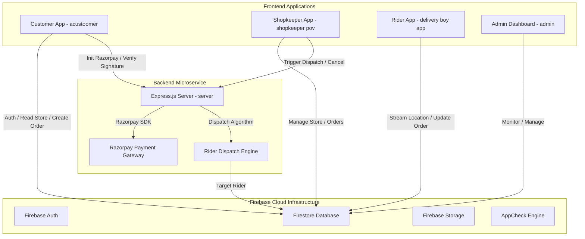
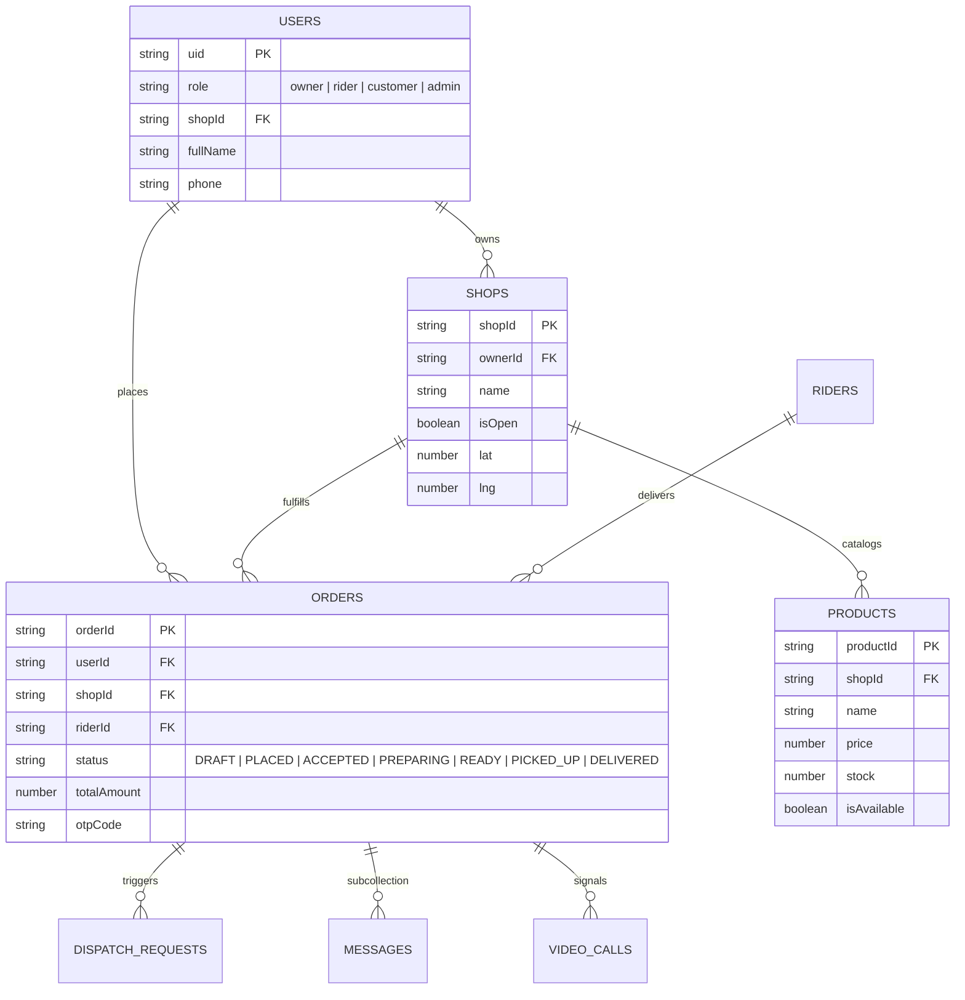
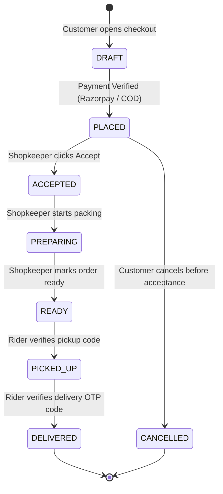

# Kart Kirana — System Architecture & Dependency Graph

**Purpose:** Master Architectural Map & Dependency Reference for Engineering Team  
**Scope:** Shared Firebase Models, Cross-App Event Flow, API Boundaries, & Component Dependencies.

---

## 1. High-Level Ecosystem Topology

---

## 2. Shared Firestore Data Schema Dependencies

---

## 3. Cross-App Module & Code Dependency Map

| Module / Service | Exporting Source | Consuming Applications | Risk Rating | Regression Guard Constraint |
| :--- | :--- | :--- | :---: | :--- |
| **`firestore.rules`** | Workspace Root | All 4 Apps + `server` | 🔴 **CRITICAL** | Modifying rule logic impacts all client permissions. Must verify with `firebase emulators:exec`. |
| **`orderStatus.ts`** | Central Types | Customer, Shopkeeper, Rider, Admin | 🔴 **CRITICAL** | Modifying order status strings or enums breaks real-time snapshot filters in all apps. |
| **`paymentService.js`** | `server/services` | Customer App, Razorpay Webhook | 🔴 **CRITICAL** | Changes to amount calculations or signature logic cause payment verification failures. |
| **`dispatchService.js`** | `server/services` | Rider App, Admin Operations | 🟡 **HIGH** | Modifying dispatch algorithms alters rider assignment priority. |
| **`useAppStore.ts`** | `acustoomer/src/core` | Customer App Pages | 🟡 **HIGH** | Centralized Zustand store; handles shop caching and realtime order snapshot listeners. |

---

## 4. Order Lifecycle State Machine & Event Cascade

### State Modification Rule Matrix:
1. **DRAFT ➔ PLACED:** Handled strictly by `server/services/paymentService.js` after Razorpay signature verification or COD commitment.
2. **ACCEPTED / PREPARING / READY:** Handled strictly by Shopkeeper App (`shopkeeper pov`).
3. **PICKED_UP / DELIVERED:** Handled strictly by Rider App (`delivery boy app`) via verified OTP code matching `orders/{orderId}` doc.
4. **CANCELLED / RE-ASSIGN:** Handled by Customer (if status == `PLACED`) or Admin Dashboard (`admin`).

---

## 5. Safe Engineering Guidelines for Developers

1. **Shared Enum Stability:** Never rename an order status string (`PLACED`, `ACCEPTED`, `PREPARING`, `READY`, `PICKED_UP`, `DELIVERED`, `CANCELLED`). All 4 frontends and backend share these exact literals.
2. **Address Schema Compatibility:** All apps expect delivery address objects to contain `{ address, lat, lng, details, area, city, pinCode }`. When adding Google Places geocoding, maintain this exact schema.
3. **Inventory Deduction Lock:** Always perform inventory deduction using Firestore transactions (`db.runTransaction`) to guarantee atomic consistency.
