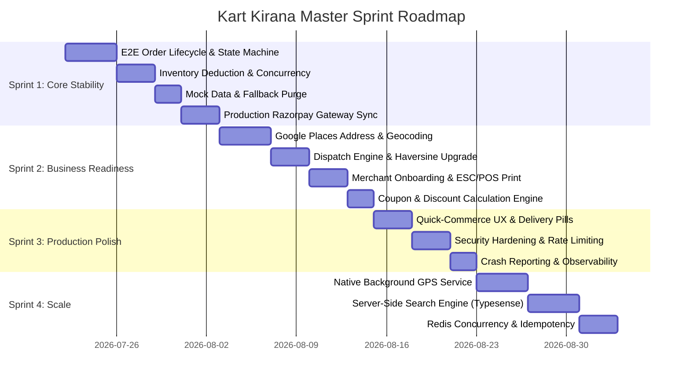

# Kart Kirana — Master Engineering Execution Plan & Sprint Roadmap

**Role:** CTO & Lead Engineering Manager  
**Target:** Production Pilot Launch (Real Users & Real Payments)  
**Core Strategy:** Reliability ➔ Correctness ➔ User Experience ➔ Performance ➔ Scalability  
**Scope:** Customer App (`acustoomer`), Shopkeeper App (`shopkeeper pov`), Rider App (`delivery boy app`), Admin Dashboard (`admin`), Backend Server (`server`), Firebase & Firestore Infrastructure.

---

## Executive Summary & Engineering Strategy

This document is the **Master Engineering Roadmap** for Kart Kirana. It translates our technical due-diligence audit into an actionable, sprint-by-sprint execution plan designed to take Kart Kirana from its current state to a successful, production-ready pilot launch.

### Execution Principles:
1. **Zero Mock Fallbacks in Production Code Paths:** Hardcoded test data, fallback mock users, and mock QR payment flows will be cleanly segregated behind environment flags (`NODE_ENV === 'development'`).
2. **End-to-End Reliability First:** Sprints are ordered sequentially to guarantee that every task in Sprint $N$ has all prerequisite dependencies completed in Sprint $N-1$.
3. **Evidence-Based Acceptance Criteria:** Every task includes unambiguous verification criteria that QA and Lead Engineers can test before signing off.

---

## Sprint-by-Sprint Engineering Backlog



---

### Sprint 1: Core Stability (Must-Have Foundation)
*Focus: End-to-End Order Lifecycle, Payment Flow, Real Data, & Data Integrity.*

#### Task `S1-1` | P0 | End-to-End Order State Machine Synchronization
- **Description:** Audit and align the complete order lifecycle across Customer, Shopkeeper, Rider, and Admin apps: `DRAFT ➔ PLACED ➔ ACCEPTED ➔ PREPARING ➔ READY ➔ PICKED_UP ➔ DELIVERED` (or `CANCELLED`).
- **Why it Matters:** Prevents desynchronization where an order shows "Preparing" in Customer App but "Ready" in Shopkeeper App.
- **Affected Apps:** All 4 Apps + `server`.
- **Estimated Effort:** 4 Days.
- **Dependencies:** None.
- **Acceptance Criteria:**
  1. Placing an order in Customer App immediately broadcasts real-time update to target Shopkeeper App via Firestore snapshot.
  2. Shopkeeper clicking "Accept" updates Customer tracking screen within 1.5 seconds.
  3. Rider accepting order transitions status to "PICKED_UP" upon OTP verification.
  4. Final delivery code verification updates status to "DELIVERED" across all 4 apps simultaneously.

#### Task `S1-2` | P0 | Atomic Inventory Deduction & Oversell Safeguard
- **Description:** Refactor `inventoryService.js` to enforce strict Firestore transactions during order checkout for stock reservation and deduction.
- **Why it Matters:** Prevents two customers from buying the last remaining item simultaneously.
- **Affected Apps:** `server`, Shopkeeper App.
- **Estimated Effort:** 3 Days.
- **Dependencies:** `S1-1`.
- **Acceptance Criteria:**
  1. Concurrent checkout attempts for an item with stock = 1 results in 1 successful placement and 1 graceful "Out of Stock" error.
  2. Cancelled orders automatically restore reserved stock to the product's available inventory count.

#### Task `S1-3` | P0 | Environment-Based Mock Data & Mock QR Purge
- **Description:** Segregate all `MOCK_SHOPS`, `MOCK_PRODUCTS`, `MOCK_BANNERS`, and Swiggy Mock QR components behind `process.env.VITE_USE_MOCK === 'true'`.
- **Why it Matters:** Ensures live production apps exclusively consume real Firestore data and live payment gateways.
- **Affected Apps:** Customer App, Shopkeeper App, Rider App.
- **Estimated Effort:** 2 Days.
- **Dependencies:** None.
- **Acceptance Criteria:**
  1. When `VITE_USE_MOCK=false`, no mock products or mock QR modals appear in the user flow under any circumstances.
  2. Fresh app installations load real Firestore records without console errors.

#### Task `S1-4` | P0 | Live Razorpay Gateway & Webhook Signature Verification
- **Description:** Harden `paymentService.js` for live Razorpay payments, signature verification, and COD handling.
- **Why it Matters:** Guarantees that orders are only marked "PLACED" when payment is cryptographically verified by Razorpay.
- **Affected Apps:** Customer App, `server`.
- **Estimated Effort:** 3 Days.
- **Dependencies:** `S1-1`.
- **Acceptance Criteria:**
  1. Successful Razorpay payment triggers backend signature verification and updates order status to "PLACED".
  2. Failed/Cancelled Razorpay payment releases reserved inventory automatically.

---

### Sprint 2: Business Readiness (Operational & Merchant Workflow)
*Focus: Addresses, Maps, Merchant Onboarding, Printing, & Coupons.*

#### Task `S2-1` | P0 | Google Places Autocomplete & Precise Map Pin Selector
- **Description:** Integrate Google Places API and interactive map pin location selector during address creation and checkout.
- **Why it Matters:** Guarantees precise lat/lng coordinates for riders, eliminating 10-15 minute delivery delays caused by vague manual text addresses.
- **Affected Apps:** Customer App (`acustoomer`).
- **Estimated Effort:** 4 Days.
- **Dependencies:** `S1-1`.
- **Acceptance Criteria:**
  1. Typing an address in checkout displays instant Google Places suggestions.
  2. Moving the pin on satellite map updates latitude/longitude and address text dynamically.
  3. Address payload saved to Firestore includes verified `lat`, `lng`, `landmark`, and `flatNo`.

#### Task `S2-2` | P1 | Rider Dispatch Engine & Haversine Distance Upgrade
- **Description:** Refactor `dispatchService.js` to calculate rider proximity using Haversine with urban road traffic multiplier (1.35x) and automated 30-second rider acceptance timeout loop.
- **Why it Matters:** Ensures the nearest active online rider receives order assignment first, auto-reassigning if unaccepted.
- **Affected Apps:** `server`, Rider App.
- **Estimated Effort:** 3 Days.
- **Dependencies:** `S1-1`.
- **Acceptance Criteria:**
  1. New order automatically targets online riders within a 5km radius sorted by distance.
  2. If targeted rider does not accept within 30 seconds, dispatch engine auto-reassigns to the next nearest rider.

#### Task `S2-3` | P2 | Bluetooth ESC/POS Thermal Receipt Printing
- **Description:** Add Web Bluetooth / Serial ESC/POS thermal printing support in Shopkeeper App for 58mm/80mm receipt printers.
- **Why it Matters:** Allows store owners to print instant packing/kitchen slips upon order acceptance.
- **Affected Apps:** Shopkeeper App (`shopkeeper pov`).
- **Estimated Effort:** 3 Days.
- **Dependencies:** `S1-1`.
- **Acceptance Criteria:**
  1. Clicking "Accept & Print" automatically formats order items into ESC/POS thermal printer format and triggers Bluetooth printing.

#### Task `S2-4` | P1 | Coupons, Promo Codes, & Price Breakdown Engine
- **Description:** Validate promo codes against Firestore `coupons` collection, calculating minimum order requirements, maximum discounts, and delivery charges.
- **Why it Matters:** Ensures promotional campaigns calculate discounts correctly without financial leakage.
- **Affected Apps:** Customer App, `server`.
- **Estimated Effort:** 2 Days.
- **Dependencies:** `S1-4`.
- **Acceptance Criteria:**
  1. Applying an expired or invalid coupon displays a clear error message.
  2. Valid coupons apply discount accurately to subtotal and update price breakdown total dynamically.

---

### Sprint 3: Production Polish (UI/UX, Security, & Monitoring)
*Focus: Quick-Commerce UX, Security Hardening, Observability, & Error Resilience.*

#### Task `S3-1` | P2 | Quick-Commerce UX Refinements & One-Tap Delivery Pills
- **Description:** Add floating bottom cart bar on product pages and 1-tap delivery instruction pills (`[Don't ring bell]`, `[Leave at door]`, `[Call on arrival]`).
- **Why it Matters:** Aligns Kart Kirana UX directly with Swiggy Instamart/Zepto standards.
- **Affected Apps:** Customer App (`acustoomer`).
- **Estimated Effort:** 3 Days.
- **Dependencies:** `S2-1`.
- **Acceptance Criteria:**
  1. Adding an item from any shop page displays a floating bottom cart bar showing total items, price, and "View Cart" button.
  2. Selected delivery instruction pills persist into the order payload.

#### Task `S3-2` | P1 | API Security Hardening, AppCheck, & OTP Rate Limiting
- **Description:** Enforce strict phone-number-specific sliding window rate limits on `/api/send-otp` and verify Firebase AppCheck tokens on all sensitive backend routes.
- **Why it Matters:** Prevents SMS toll fraud, API spam, and unauthorized database access.
- **Affected Apps:** `server`, Firebase Config.
- **Estimated Effort:** 3 Days.
- **Dependencies:** `S1-4`.
- **Acceptance Criteria:**
  1. Requesting > 3 OTPs to the same phone number within 10 minutes returns HTTP 429 Too Many Requests.
  2. Direct API calls without valid Firebase AppCheck token are rejected by Firestore/Backend.

#### Task `S3-3` | P1 | Observability, Logging, & Crash Reporting Integration
- **Description:** Integrate Sentry / Firebase Crashlytics for frontend apps and Winston/Morgan structured logging for Express backend.
- **Why it Matters:** Provides real-time alerts for unhandled exceptions or payment failures in production.
- **Affected Apps:** All 4 Apps + `server`.
- **Estimated Effort:** 2 Days.
- **Dependencies:** None.
- **Acceptance Criteria:**
  1. Uncaught JS exceptions in mobile apps send structured stack traces to Sentry/Crashlytics dashboard.
  2. Backend HTTP requests log status code, latency, and request ID in JSON format.

---

### Sprint 4: Scale & Advanced Infrastructure (Post-Pilot Expansion)
*Focus: Background Tracking, High-Scale Search, Distributed Locking.*

#### Task `S4-1` | P0 (For Scale) | Native Background Geolocation Service
- **Description:** Integrate `@capacitor-community/background-geolocation` native Android foreground service with persistent notification bar.
- **Why it Matters:** Maintains continuous 5-second rider location updates even when screen is locked or app is minimized.
- **Affected Apps:** Rider App (`delivery boy app`).
- **Estimated Effort:** 4 Days.
- **Dependencies:** `S2-2`.
- **Acceptance Criteria:**
  1. Rider location streams continuously to Firestore while phone screen is locked or while using external Google Maps navigation.

#### Task `S4-2` | P1 (For Scale) | Server-Side Search Engine (Typesense / Algolia)
- **Description:** Deploy Typesense instance synced with Firestore `products` collection for instant fuzzy search, typo tolerance, and auto-suggestions.
- **Why it Matters:** Replaces client-side array search, scaling search to 100,000+ items seamlessly.
- **Affected Apps:** Customer App, `server`.
- **Estimated Effort:** 4 Days.
- **Dependencies:** `S1-3`.
- **Acceptance Criteria:**
  1. Search queries return relevant results in under 50ms regardless of database size.

#### Task `S4-3` | P1 (For Scale) | Redis Concurrency Lock (`Redlock`) & Webhook Idempotency
- **Description:** Add Redis layer for distributed item locking during flash sales and webhook idempotency logging.
- **Why it Matters:** Prevents duplicate credits from payment retries and locks stock across distributed server nodes.
- **Affected Apps:** `server`.
- **Estimated Effort:** 3 Days.
- **Dependencies:** `S1-2`, `S1-4`.
- **Acceptance Criteria:**
  1. Duplicate payment webhook events with the same `event_id` are identified and ignored safely.

---

## Production Launch Checklist

```
+-----------------------------------------------------------------------------------+
|                        KART KIRANA MASTER LAUNCH CHECKLIST                        |
+-----------------------------------------------------------------------------------+
| [ ] 1. FUNCTIONAL VERIFICATION                                                    |
|     - Customer can register, select address via Google Places, and place order.   |
|     - Shopkeeper receives instant alert, accepts, packs, and marks order ready.   |
|     - Rider receives order assignment, navigates, verifies OTP, and delivers.     |
|     - Admin dashboard reflects live metrics and order updates accurately.         |
|                                                                                   |
| [ ] 2. SECURITY & COMPLIANCE VERIFICATION                                         |
|     - Environment variable VITE_USE_MOCK set to FALSE in production build.       |
|     - Firebase AppCheck and firestore.rules strictly enforced.                    |
|     - OTP endpoint rate-limited per phone number (max 3 per 10 mins).             |
|     - Payment signature verification cryptographically validated by server.       |
|                                                                                   |
| [ ] 3. PERFORMANCE & STABILITY VERIFICATION                                       |
|     - App launch time under 1.5s on mid-tier mobile devices.                      |
|     - Zero unhandled console errors or memory leaks during order lifecycle.       |
|     - Sentry / Crashlytics error monitoring active on all apps.                  |
|                                                                                   |
| [ ] 4. PRODUCTION BUILD VERIFICATION                                              |
|     - Signed release APK and AAB bundles built cleanly without warnings.          |
|     - Backend deployed on production Node.js environment with SSL/TLS active.     |
+-----------------------------------------------------------------------------------+
```

---

## Conclusion & Next Steps

This **Master Engineering Execution Plan** establishes a clear, un-blocked roadmap to production. By focusing on **Sprint 1 (Core Stability)** and **Sprint 2 (Business Readiness)** first, Kart Kirana will achieve complete operational readiness for its first public pilot with real users and live payments.
